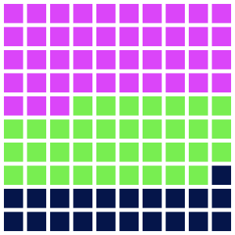

---
authors:
    - marepilc
date: 2025-02-11 
categories:
  - Data Visualization
---

# Waffle Chart

Everyone knows that pie charts are overused. This example shows how to quickly build the waffle chart.

<figure class="light-dark-bg" markdown="span">
  { width="300" }
  <figcaption>Waffle chart</figcaption>
</figure>

First, let's import the necessary components.

```py linenums="1"
import pydreamplet as dp
from pydreamplet.colors import random_color
```

Then we also need some data (sorted).

```py linenums="3"
data = [130, 65, 108]
data.sort(reverse=True)
```

We define the square size, gutter, and how many squares we want to have on every side. Usually, we want to show the share in %, therefore a reasonable choice is to have a 10 by 10 chart. We also need to know the sum of values from the given dataset.

```py linenums="5"
side = 300
side_count = 10
gutter = 5
total_cells = side_count ** 2
total = sum(data)
```

Next, we have to calculate how many cells each group should fill.

```py linenums="10"
proportions = [int(round(d / total * total_cells, 0)) for d in data]
``` 

Now we have to compute the cell size, ensuring gutters on both sides.

```py linenums="11"
cell_side = (side - (side_count + 1) * gutter) / side_count
```

Create a list that maps each square index to a group (color).

```py linenums="12"
cell_group_map = []
for group_index, count in enumerate(proportions):
    cell_group_map.extend([group_index] * count)
```

If there's any discrepancy, fill the rest with a default group (optional).


```py linenums="15"
if len(cell_group_map) < total_cells:
    cell_group_map.extend([None] * (total_cells - len(cell_group_map)))
```

Create a separate path for each group.

```py linenums="17"
paths = {i: "" for i in range(len(data))}
```

Loop over all squares using index-based placement. You can determine the row and column index using modulo and floor division (lines 19-20). Remember to only draw if the cell belongs to a group (not left as None; see lines 25-27).

```py linenums="18" hl_lines="2-3 8-10" 
for i in range(total_cells):
    col = i % side_count
    row = i // side_count

    x = gutter + col * (cell_side + gutter)
    y = gutter + row * (cell_side + gutter)

    group = cell_group_map[i]
    if group is not None:
        paths[group] += f"M {x} {y} h {cell_side} v {cell_side} h -{cell_side} Z "
```

Create an SVG element with the specified dimensions.

```py linenums="28"
svg = dp.SVG(side, side)
```

And finally, append each group's path element to the SVG.

```py linenums="29"
for group_index, d_str in paths.items():
    if d_str:
        path = dp.Path(d=d_str, fill=random_color())
        svg.append(path)
```

That's it. If you are using Jupyter Notebook, you can render your chart using `svg.display()`. Alternatively, save your chart to a file.

```py linenums="33"
svg.save("waffle_chart.svg")
```
