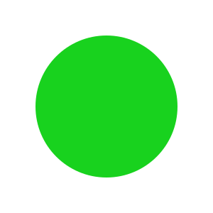

# Getting Started with pyDreamplet

pyDreamplet is a Python library designed for creating stunning SVG visualizations effortlessly. This guide covers installation, basic usage, and pointers for exploring additional features to help create captivating visual art with code.

## Installation

=== "poetry"

    ```shell
    poetry add pydreamplet
    ```

=== "pip"

    ```shell
    pip install pydreamplet
    ```

## Basic Example

The following example demonstrates how to create a simple SVG canvas, draw a shape, and save the result to a file.

```py title="Your first SVG" linenums="1"
import pydreamplet as dp
from pydreamplet.colors import random_color

svg = dp.SVG(300, 300)

circle = dp.Circle(
    cx=svg.width/2,
    cy=svg.height/2,
    r=100,
    fill=random_color(),
)
svg.append(circle)

svg.display()  # to display result in jupyter notebook

svg.save("example.svg")
```

This will create such a image

<figure markdown="span">
  { width="300" }
  <figcaption>Output of the code above</figcaption>
</figure>


pyDreamplet provides various functions to generate complex visuals, such as:

- **Drawing Multiple Shapes:** Create combinations of lines, circles, and custom paths.
- **Styling Options:** Apply gradients, patterns, and advanced styling techniques.
- **Animations:** If supported, add animation effects to SVG elements.

For detailed information on all available functions and parameters, consult the API reference.


!!! info "Next steps"

    - **Experiment with Examples:** Modify the basic example by adding new shapes or changing colors to see different effects.
    - [**Review the API Documentation:**](../reference/core/svg.md) Learn about the full range of functions available in pyDreamplet.
    - [**Explore the Blog:**](../blog/index.md) Discover advanced examples and creative projects that showcase the library’s capabilities.