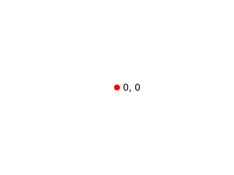
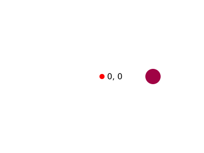
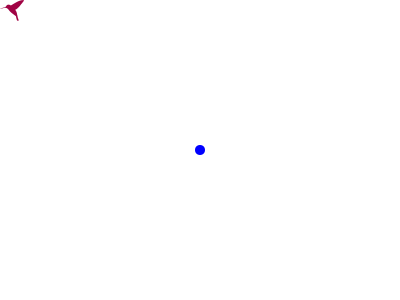

# Vector transformations

## Vector math

You can control the position of elements like [`Circle`](../reference/core/circle.md), [`Ellipse`](../reference/core/ellipse.md), [`Rect`](../reference/core/rect.md), [`Text`](../reference/core/text.md), and even groups ([`G`](../reference/core/g.md)) using vector operations. In the case of a `G` element, vectors are additionally used to control scaling and the pivot point for rotation.

Consider the following example:

```py
from pydreamplet import Circle, G, SVG, Text, Vector

svg = SVG(400, 300)
origin = G(id="origin")
svg.append(origin)
origin.append(
    Circle(cx=0, cy=0, r=5, fill="red"),
    Text("0, 0", x=10, y=0, dominant_baseline="middle"),
)
```

{.img-light-dark-bg}

he SVG’s origin is at the top left, so much of the content is off-screen. To center it, you can transform the origin (`<g>` element) like so:

```py
origin.pos += Vector(svg.w / 2, svg.h / 2)
```

{.img-light-dark-bg}

Now let’s add a circle relative to the new origin. We define a vector for its position:

```py
circle_pos = Vector(100, 0)
origin.append(Circle(pos=circle_pos, r=15, fill="#a00344"))
```

{.img-light-dark-bg}

Next, you can use vector math to add additional circles evenly spaced around the origin. By incrementing the vector’s direction by 72° each time, you form a ring of 5 circles:

```py
for _ in range(4):
    circle_pos.direction += 72
    origin.append(Circle(pos=circle_pos, r=15, fill="#a00344"))
```

{.img-light-dark-bg}


## Transformation order

Transformation order matters. Here is an example:

```py
from importlib.resources import files
from pydreamplet import SVG, G, resources

hummingbird = SVG.from_file(files(resources) / "hummingbird.svg").find("path")
hummingbird.fill = "#a00344"


svg = SVG(400, 300)
g = G(id="origin")
svg.append(g.append(hummingbird))
```

{.img-light-dark-bg}

Now let's try to rotate it by 30 degrees, move to the center and scale 5 times.