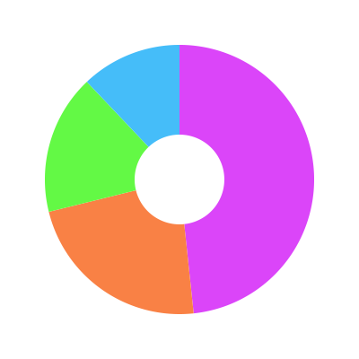

# Helper functions

This module provides utility functions for various mathematical operations and unit conversions. It includes functions for rounding numbers using a round half up method, constraining values within a specified range, converting between degrees and radians, and generating rounded tick values for grid lines.

## <span class="func"></span>`math_round`

```py
math_round(x)
```

Rounds `x` to the nearest integer using the round half up method.

<span class="param">**Parameters**</span>

- `x` *(float)*: The number to round.

<span class="returns">**Returns**</span>

*(int)*: The rounded integer.

```py
print(math_round(3.4))  # Output: 3
print(math_round(3.6))  # Output: 4
```

## <span class="func"></span>`constrain`

```py
constrain(value, min_val, max_val)
```

Constrains the given `value` between `min_val` and `max_val`.

<span class="param">**Parameters**</span>

- `value` *(numeric)*: The value to be constrained.
- `min_val` *(numeric)*: The minimum allowed value.
- `max_val` *(numeric)*: The maximum allowed value.

<span class="returns">**Returns**</span>

*(numeric)*: The constrained value.

```py
print(constrain(10, 0, 5))  # Output: 5
print(constrain(-3, 0, 5))  # Output: 0
```

## <span class="func"></span>`radians`

```py
radians(degrees)
```

Converts an angle from degrees to radians.

<span class="param">**Parameters**</span>

- `degrees` *(float)*: Angle in degrees.
- 
<span class="returns">**Returns**</span>

*(float)*: Angle in radians.

```py
print(radians(180))  # Output: 3.141592653589793 (approximately)
```

## <span class="func"></span>`degrees`

```py
degrees(radians)
```

Converts an angle from radians to degrees.

<span class="param">**Parameters**</span>

- `radians` *(float)*: Angle in radians.

<span class="returns">**Returns**</span>

*(float)*: Angle in degrees.

```py
print(degrees(3.141592653589793))  # Output: 180.0
```

## <span class="func"></span>`calculate_ticks`

```py
calculate_ticks(min_val, max_val, num_ticks=5, below_max=False)
```

Generates a list of rounded tick values between `min_val` and `max_val`. The number of ticks is approximately equal to `num_ticks`.

<span class="param">**Parameters**</span>

- `min_val` *(float)*: The minimum value.
- `max_val` *(float)*: The maximum value.
- `num_ticks` *(int, optional)*: The desired number of tick values (default: 5).
- `below_max` *(bool)*: If set to `True` last tick is always below `max_val`. Default: `False`

<span class="returns">**Returns**</span>

*(list[int])*: A list of rounded tick values.

Raises `ValueError`: If min_val is not less than max_val.

```py
ticks = calculate_ticks(0, 100, num_ticks=5)
print(ticks)  # Example output: [0, 20, 40, 60, 80, 100]
```

## <span class="func"></span>`pie_angles`

```py
pie_angles(values, start_angle=0)
```
Calculates the start and end angles (in degrees) for each pie slice based on their proportional values. The function divides the full circle (360°) among the slices in proportion to their values.

<span class="param">**Parameters**</span>

- `values` *(list[int | float])*: A list of numerical values representing the sizes of each pie slice.
- `start_angle` *(int | float, optional)*: The starting angle (in degrees) for the first slice (default: 0).

<span class="returns">**Returns**</span>

*(list[tuple[float, float]])*: A list of tuples where each tuple contains the start and end angles for a slice.

Raises `ZeroDivisionError`: If the sum of `values` is zero.

```py
angles = pie_angles([1, 2, 3])
print(angles)  
# [(0, 60.0), (60.0, 180.0), (180.0, 360.0)]
```

```py title="Usage example"
import pydreamplet as dp
from pydreamplet.shapes import ring
from pydreamplet.utils import pie_angles
from pydreamplet.colors import generate_colors

data = [25, 34, 18, 72]

svg = dp.SVG(400, 400)
g = dp.G(pos=dp.Vector(svg.w / 2, svg.h / 2))
svg.append(g)

segments = pie_angles(sorted(data, reverse=True), -90)
colors = generate_colors("#db45f9", len(segments))

for i, segment in enumerate(segments):
    g.append(dp.Path(
        d=ring(0, 0, inner_radius=50, outer_radius=150, start_angle=segment[0], end_angle=segment[1]),
        fill=colors[i]
    ))

svg.display()
```
<figure class="light-dark-bg" markdown="span">
  
  <figcaption>Result</figcaption>
</figure>